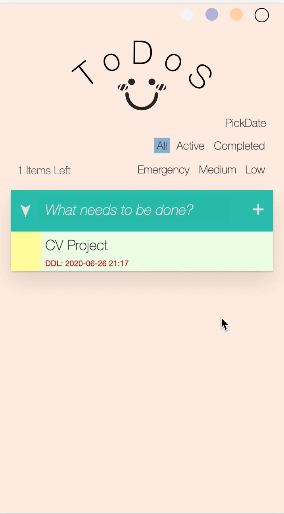
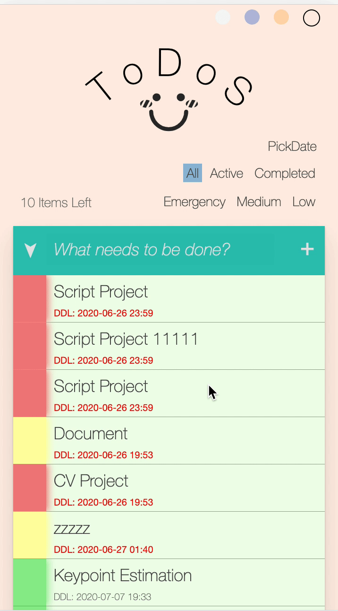
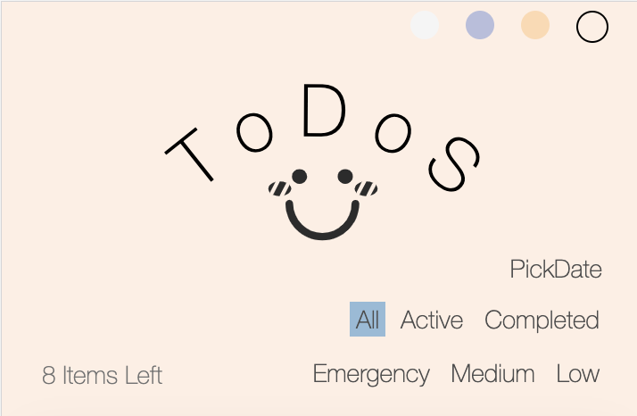
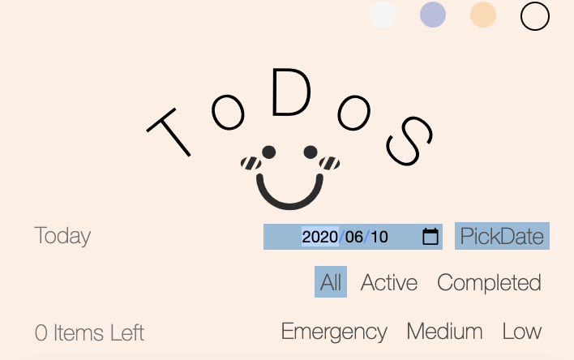

<h3><center>ToDoS文档</center></h3>

<center>1651573 刘客</center>

-----

[TOC]

## 1. 部署情况与github地址

网站: 47.102.158.185:7322/todo-list.html

github地址: https://github.com/LkFiveeeeeeee/ScriptDesign [暂时private, 周六会更改为public]

## 2.  功能实现情况

**基本功能**

- [x] 新增 ```ToDo```
- [x] 展现```ToDo```列表
- [x] 删除```ToDo``` (右滑删除)
- [x] 全部完成/取消
- [x] 删除已完成
- [x] 保存页面状态

**高级功能**

- [x]  以dialog的形式新建或者编辑```ToDo```
- [x]  ```ToDo```具有三种颜色的标签(E,M,L)，分别代表紧急、中等、以及不太紧急的事务
- [x]  多级过滤 [第一级(all, active, completed), 第二级(emergency, medium, low), 第三级(date)]
- [x]  ```ToDo```中具有 DDL
- [x]  可通过左滑```ToDo```更换标签
- [x]  动画效果，包括显示、隐藏```ToDo```表项，以及部分按钮的现实和隐藏
- [x]  DDL 临近日期变色
- [x]  App提供四种4格颜色进行变换

**亮点**
+ 通过二次曲线绘制了标题
+ todo count动态计数，在不同的过滤条件下可以仅技术选中的过滤项，并且如果可以clear，也只clear对应的todo items.
+ 按钮的动态消隐，在不同的过滤条件下，会判断相应的情况，进行显示或者隐藏

一些缺陷

+ 在老师没讲viewport前，我就已经开始写css了。当时并不知道viewport可以缩放，所以css的数值设的比较奇怪，后来也没有更改。在pc端上会显示的比较大，但是在移动端上经过我测试，可以在多种型号的手机上比较好地去适配。

## 3. 文档目录与借鉴代码情况

```
Final
|
|-- resources
|      |-- smell.png
|
|-- model.js
|
|-- provider.js
|
|-- timeformat.js
|
|-- todo-list.js
|
|-- todo-list.css
|
|-- Readme
```

其中 model.js 以及 provider.js 参考了老师的实现，但是model要存储的东西根据我的情况进行调整，我个人认为已经理解了其中的代码逻辑。

todo-list.css 中的部分样式参考了老师上课时展示的todo-mvc风格即字体和阴影等样式，但是从布局上来说做了比较大的改动，把很多相对定位绝对定位的样式转变为float实现以及做了很多样式上的调整。

todo-list.html 参考了部分页面结构的实现，但我自己做了非常大的调整。

## 4. 一些功能展示

> 添加ToDo

分为两种情况

+ 直接添加 会默认ddl为1小时之后，并且优先级为并不紧急
+ 长按添加 可以对属性进行详细设置


> 编辑ToDo以及ddl变色

长按 ToDo 的子项可以弹出dialog进行编辑，可以设定的时间的最小值时当前时间。当设定的时间与当前的是钱差值小于1天时，变红。 小于2天是，变褐黄色。 



> 滑动删除



> 更改tag

可以通过两种方式更改Tag

+ 通过编辑dialog
+ 通过左滑滑出更改折叠项，进行更改


> 风格变色


> 多级动态过滤

动态过滤总共包括三级

+ 第一级 [all active completed], 该过滤为单选，当激活一个时，其他将不被激活。
+ 第二级 [emergency medium low], 该过滤为对tag的过滤，可以多选。 当都不选时，默认为全部。
+ 第三级 [pick date], 该过滤为对ddl的过滤，精确到每个月的每一天。可以不唤醒，则不会使用该过滤。

|  |  |
| :--------------------: | :------------------------------: |
|    不激活 pick date    |          激活 pick date          |

动态过滤 ItemsLeft 以及 clear Completed说明

+ 第一级过滤 不会影响上述两个的出现或者值的变化

+ 这两个的出现或者变化只针对第二级过滤以及第三级过滤而言。

  举个例子，如果选择了Low，那么clear completed的时候，只会clear掉 tag 是Low的已完成的item。同理，如果只选择了Low，那么 Items Left 的数量只描述tag为Low的剩余的item的数量。


GIF 图并不能展示很好的效果，还请实际尝试。